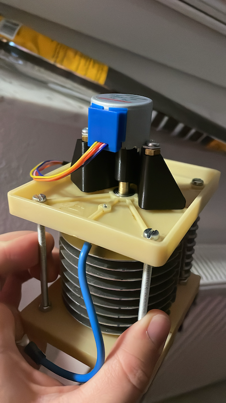

# Basteln-Antennenverstellung

Dies ist der Code für eine Verstellung einer MagLoop-Antenne für das Amateurfunken.

Mit einem Arduino Nano wird ein Schrittmotor angesteuert um einen Plattenkondensator einzustellen.

MagLoop:

Controller:

Schrittmotor:
 -->
